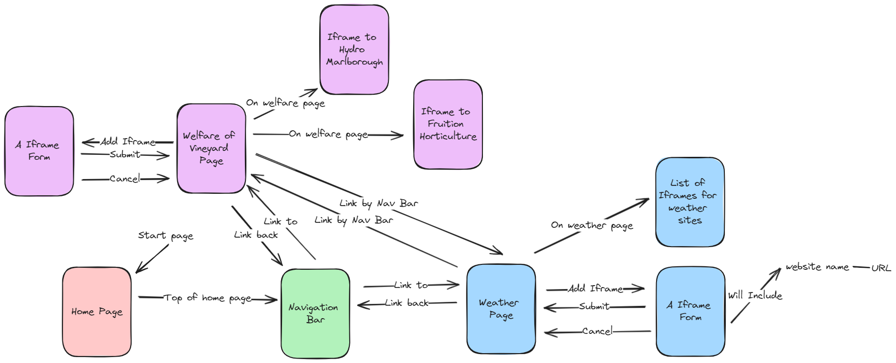

# Development of a Database-Linked Website for NCEA Level 2

Project Name: **PROJECT NAME HERE**

Project Author: **YOUR NAME HERE**

Assessment Standards: **91892** and **91893**

-------------------------------------------------

## Design, Development and Testing Log

### 16/05/2024

In DrawSQL, I am working on V1 the wire frame for the Vineyard Website  

I am working on creating a layout for the website. This will be done by having the home page as the hub to get to various parts of the website.  
Flow chart one is my first version of the wire frame without any input by the end user. 

 
 

Flow chart two is my revamped design of flow chart one. I did this because i wanted to make sure I have a thought-out design, before I show this to my end user to get their honest feedback. 

### DATE HERE

Replace this test with what you are working on

Replace this text with brief notes describing what you worked on, any decisions you made, any changes to designs, etc. Add screenshots / links to other media to illustrate your notes where necessary.

### DATE HERE

Replace this test with what you are working on

Replace this text with brief notes describing what you worked on, any decisions you made, any changes to designs, etc. Add screenshots / links to other media to illustrate your notes where necessary.

### DATE HERE

Replace this test with what you are working on

Replace this text with brief notes describing what you worked on, any decisions you made, any changes to designs, etc. Add screenshots / links to other media to illustrate your notes where necessary.

### DATE HERE

Replace this test with what you are working on

Replace this text with brief notes describing what you worked on, any decisions you made, any changes to designs, etc. Add screenshots / links to other media to illustrate your notes where necessary.

### DATE HERE

Replace this test with what you are working on

Replace this text with brief notes describing what you worked on, any decisions you made, any changes to designs, etc. Add screenshots / links to other media to illustrate your notes where necessary.