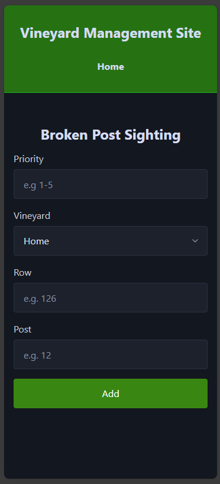

# The Design of a Database-Linked Website for NCEA Level 2

Project Name: **VINEYARD DATA WEBSITE**

Project Author: **JAMES BLACK**

Assessment Standards: **91892** and **91893**

-------------------------------------------------

## NOTE ##
Meant to be viewed as a app on a phone.
To view, press Ctrl + I at the same time, Then press Ctrl + Shift + M

## System Requirements

To gather information about the acidity of the soil, what regions of Blenheim are being irrigated now, client horticulture and the annual grape harvest. With also has a hub that links to weather websites.    
I.e., We have the website set up to be able to pool data that is supplied by the end user, then the website calculates the average and then puts the averaged data into a graph that tracks the trend of how many grapes have been harvested.  

### Identified Need or Problem

The main underlying problem that the end user has is that they must go through a dozen websites every Monday morning to find the average weather patterns for the next couple of days. This also includes other prospects like the acidity of the soil 

### End-User Requirements

For my project/ app that I am designing for my end user that will help him in his day-to-day life whilst working on the vineyard, I need to take my end users thoughts and ideas on the project, heavily into consideration. With all this I am mind, the end user wants me to create an app that can be used regularly on his phone. This app will consist of having Iframes that will grant him quick access to different website across the internet. The end user would also like to include a broken post sighting system. This sighting system will let the end user fill out a form that will ask them a few questions about where they saw the broken post, then will format that sighting into a list that will tell him where all the post that need fixing are.  

### Proposed Solution

I intend to create an app that can be accessed by phone and computer (But intend for phone). This app will be used for tracking the weather, acidity of the soil, irrigation watering and pooling sightings of broken posts into one area so that the end user can know where every broken post in both vineyards are located, whilst also informing the end user about other key details, I.e., Cost, priority and more. The key functionality of this website is to make the end users life less demanding throughout the day. 

-------------------------------------------------

## Relevant Implications

Functionality,
Aesthetic,
End-Users &
Accessibility Of Digital Technologies

### Functionality

The relevant implication of functionality talks about how the website is functional to the end user. An example of this is asking the question, does the website do what the end user intended? 

This implication is relevant to the project because if the website is not functional or not completing its tasks to the fullest, then the website will become obsolete. 

I need to consider the fact that there are a lot of intended features that are going to be on this website that i am creating, this means that i might not be able to get all the intended features that i am wanting to add, onto the website. 

### Aesthetic

The relevant implication that I have picked for this part of the topic is Aesthetic. Aesthetics refers to the design and appeal of the website through the choice of colour, font, design and more. 

The Aesthetics implication is relevant to the topic/website because when creating the website, we must consider what the end users want the website to be. Functionality and Aesthetics both must be present for the website to make the end user appreciate the work and effort put into it whilst being a user-friendly website. 

I need to consider the colour palette, the font, and the overall design of the website. This is because if the design of the website is not getting the point across to the end user, that this website is about keeping all the vineyard and region data in one area, then the end user might think that this website is not worth their time and effort. 

### End-User

The End-user relevant implications are the relevant implication that refers to the end user's needs. 

An example of this is, is the website accessible on all/most devices. Is the website easier to turn into an app in the end-user's phone.  

This implication is relevant to the topic/website because the end-user (Andy Black) is the person who is going to be using this website, so it must be to his liking/ standards. 

We need to consider what the end-users' interests are. This means that we must consider every topic/ idea that will be most useful for the user. 
I.e. Weather patterns, irrigation to what districts and more. 

### Accessibility Of Digital Technologies

Accessibility Of Digital Technologies is the relevant implication that asks the question on whether your website is accessible across all platforms, I.e. Phone, Table, Computer and more.  

This implication is relevant to my topic because then end user is 90 percent of the time going to be looking through this website on his phone/ portable handheld device. This means that i must turn my website into an app for his phone so that it becomes more likely for the end user to use the website/ app. 

I need to consider how to turn my website into a downloadable app that can be used on a phone instead of a computer. 

-------------------------------------------------

## Final System Design

### Database Structure
Place a image here that shows the *final design* of your database: tables, fields and relationships.

### User Interface Design

-------------------------------------------------

## Completed System

### Database Structure

Place a image here that shows the *actual database structure* that you implemented: tables, fields and relationships.

### User Interface Design

Place screenshots and notes here that show your *actual system UI* in action.

-------------------------------------------------
 

## Review and Evaluation 

### Meeting the Needs of the Users 

Throughout the creation of the Vineyard management website there have been a lot of needs that had to be met by the end user, I.e., Iframes that link to multiple weather websites, tallying data for broken posts that have been spotted/ found by the end- user, etc. Most of these needs have been have meet the success criteria of the end- user's needs. But there was a major need/want that I could not finish for the end user. This was to develop the website into a mobile app. This a critical for the end user as he will be using their phone for the main form of usage for the website. 

### Meeting the System Requirements 

The Vineyard Management app met the requirements that the end user has set in place at the start of the website. The website records data from the broken posts that have been seen throughout both vineyards. And pools that data to one place for the end user to see. But the second part of the system requirements were to pool the data and calculate the data and plot it on an annual graph to see the trend. This was not added to the website because it was too technical of a task for me to complete in the period and the expertise that I had at the time. 

 

### Review of Aesthetics 

For my Aesthetics implication, I had to be very considerate of the colour palettes the end user gives me, this is because the end user will be using the website/ app in the vineyard with the sun glaring on him. This means that we had to pick a dark toned colour palette. So, we went with Black and Green for the palette of choice. This is because the black background with the green accents will make it easier to see the app in the light of day. 

 

### Review of Functionality 

In my functionality implication, my website needed to have this implication to make the website fit the needs of the end user. This was because if the website/ app was not functional for the end user, then the website would be worthless. 
In the outcome I almost met the full success criteria that the end user had appointed me.  
I had compiled all their weather websites into iframes for them the easily access, applied the links that will take the end user to the welfare websites and have made a database that can input the broken posts that have been spotted in the vineyards by the end user.  

### Review of IMPLICATION NAME HERE

Replace this text with brief notes showing how the implication was addressed in the final outcome. Accompany the notes with screenshots / other media to illustrate specific features.

