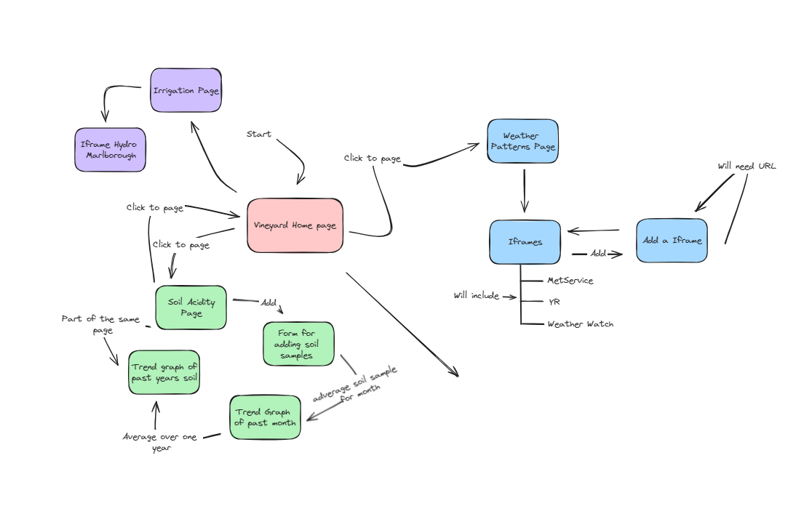
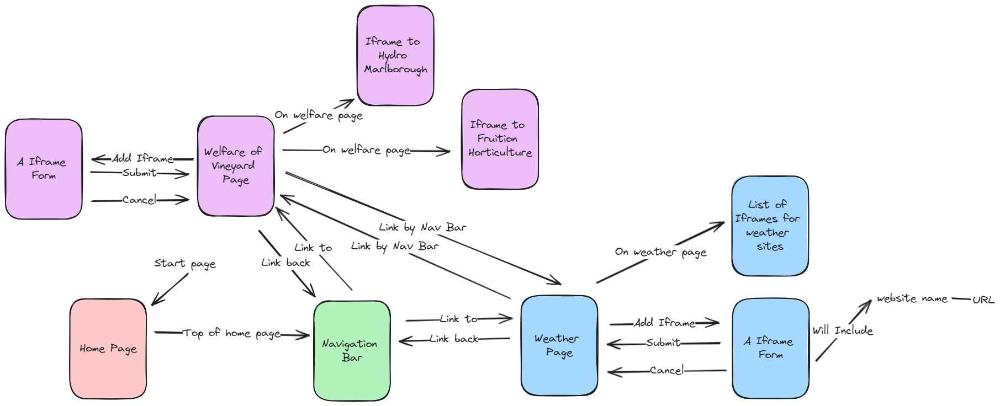
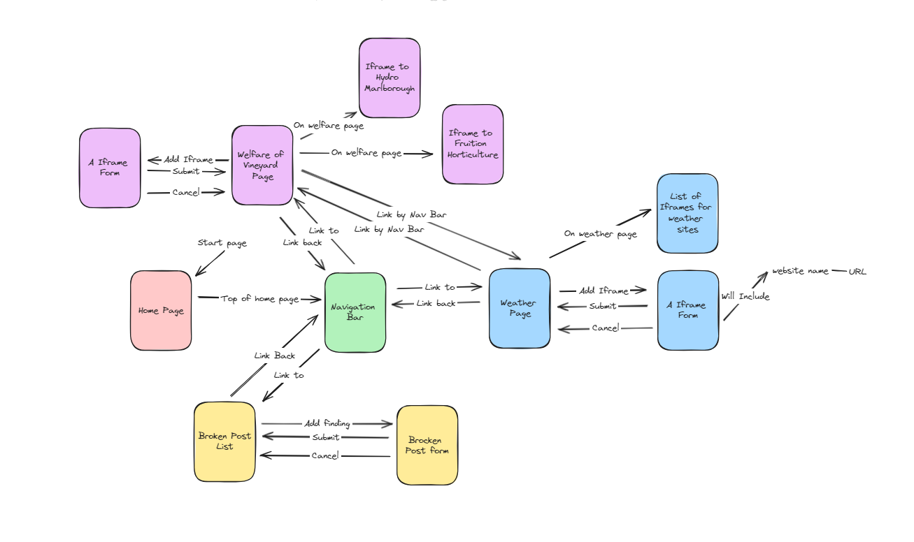
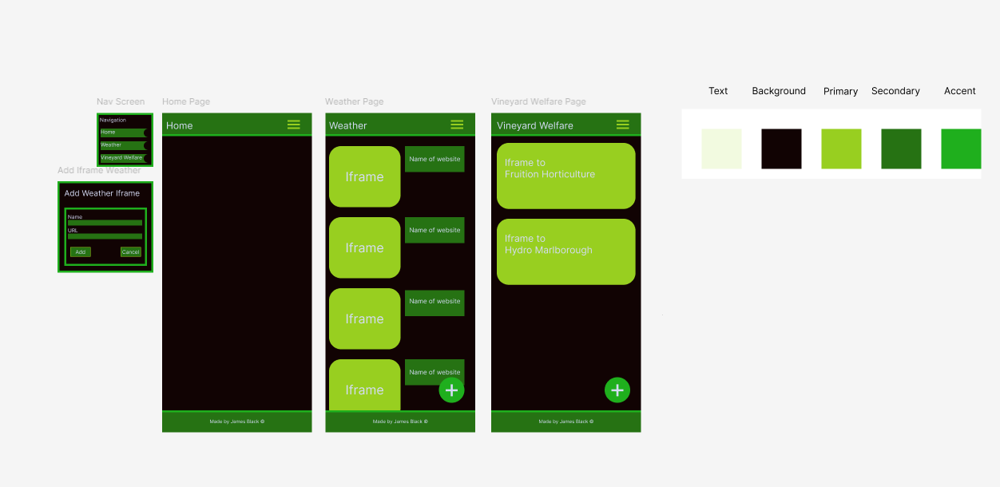
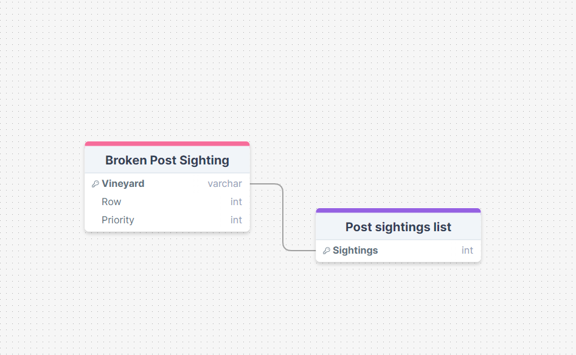
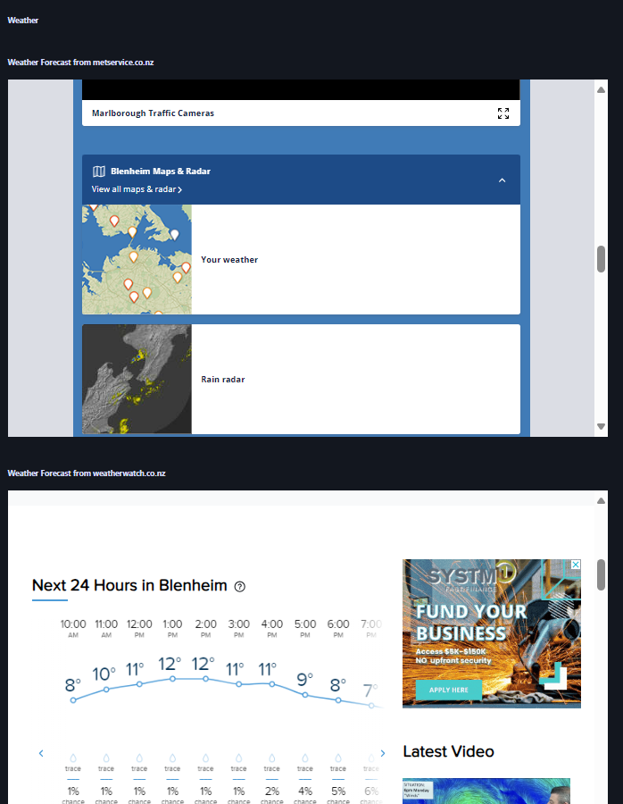
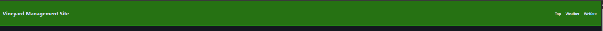
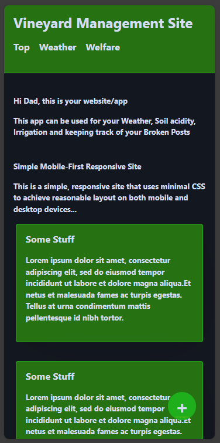

# Development of a Database-Linked Website for NCEA Level 2

Project Name: **Blenheim Vineyards Management  **

Project Author: **James Black**

Assessment Standards: **91892** and **91893**

-------------------------------------------------

## NOTE ##
Meant to be viewed as a app on a phone.
To view, press Ctrl + I at the same time, Then press Ctrl + Shift + M

## Design, Development and Testing Log

### 16/05/2024

In DrawSQL, I am working on V1 the wire frame for the Vineyard Website   

A couple of days ago, my end-user sent me a list of a couples of websites that he uses and wants to be included on the website as he wants to pool websites together as well as have a place to store his data. 

List of websites i have gotten thus far... 

Wyebrook Estate Weather Station 
Fruition Horticulture 
Hydro Marlborough/Irrigation 

I am working on creating a layout for the website. This will be done by having the home page as the hub to get to various parts of the website.  
Flow chart one is my first version of the wire frame without any input by the end user. 

 

Flow chart two is my revamped design of flow chart one. I did this because i wanted to make sure I have a thought-out design, before I show this to my end user to get their honest feedback. 

 

### 10/06/2024

Today I am working on improving the website colour palette and flow chart based on the end user's feedback 
The End user wants to have everything on one page instead of having multiple pages. This could be done by having a nav bar at the top part of the page that links down to where the end user wants to be on the page. 

 

The new design will a one page that you can traverse by either the scroll wheel or the navigation bar for fast travel to certain parts of the page, but the end user can also scroll down to where he wants on the website as well. 
I have also included an interface for the end user to record the broken posts that are found in the vineyards. 
This will include the location of which vineyard the broken post is in, what row in said vineyard and a tally counter that will tally how many broken posts there are in total for each vineyard.

Version One of the UI Figma has the selected colour palette that the end user has chosen but is not up to date with the end users' requirements of wanting everything on one page. The Version One design also does not include the list and form for marking down the locations for each broken post. 

 
### 13/06/2024

Over the past couple of days, I have been working on improving the feedback that I have been given by the teacher and the end user whom of which decides what will go on the website and what will not.  I need to have created a database that can store information in, and the end user could add and take away information that is in the database. I also worked on the fixing the end user requirements and the proposed solution. This is because i forgot to fill them in, so I went back and finished those and now I am fleshing out my relevant implications as they are a bit bare. 

### 4/07/2024 to 23/07/2024

In the large gap of time from the last development log to now, I have been working on improving the end-user's website.  

I first started by working on fleshing out the main parts of the website. Taking into consideration the end-users needs and feedback as they are the target audience. This can be seen in one of the features they want me to incorporate.  

This feature is to have all the information and usage be on a singular page. to make this a better experience I added fast travel/ navigation port on the top part of the page. This, both keeps to the end users' conditions whilst also optimising the end users experience. This is because instead of having the navigation bar linking to different pages, this navigation bar will link to various parts of the singular home page. This will optimise the users experience as it will make it a quicker route to find what they want, in the fastest possible time.  

There has also been a large amount of progress that has been done to adding the weather iframes to the website. 

So far, I have added two Iframes to the website (Weather watch and Met service). But i came across a problem when making an Iframe for the Yr. weather station. This is because the Yr. weather station does not allow the website to become an Iframe. 

I have also been working on the layout of the website, as the end user has specifically stated that he will be using his phone 90 percent of the time to view the website. But he will also sometimes be using a computer to view the website, so I also have to keep that in mind whilst making the website/ app. 

______________________________________________________________________________________________________________________

______________________________________________________________________________________________________________________

 

### 24/10/2024

The following video shows how to add a post to the list and into the database. This is ordered by Priority, Vineyard, Row then post. This is so that the end user can report a broken post to the website so that they have a list of all the posts and their location. This data is then stored in the database.

[Video Link](https://mywaimeaschool-my.sharepoint.com/:v:/g/personal/jmblack_waimea_school_nz/EU2IWkRDPeBBiLqpVhgM5GcBW4cHJCYDHAXnAQBBIRKdOg?nav=eyJyZWZlcnJhbEluZm8iOnsicmVmZXJyYWxBcHAiOiJTdHJlYW1XZWJBcHAiLCJyZWZlcnJhbFZpZXciOiJTaGFyZURpYWxvZy1MaW5rIiwicmVmZXJyYWxBcHBQbGF0Zm9ybSI6IldlYiIsInJlZmVycmFsTW9kZSI6InZpZXcifX0%3D&e=D2S1JT)

This next video shows how the end user can erase data that has been added into the database by the end user. There is also a query that double checks the end user to see if this act was on purpose or mistake. If this was a purposeful deletion made by the end user, then it will be erased from the website and the database as well.

[Video Link](https://mywaimeaschool-my.sharepoint.com/:v:/g/personal/jmblack_waimea_school_nz/ERF74-16RixNlascqseNUX4BS-KoOjcpkareDoSDQlNovg?nav=eyJyZWZlcnJhbEluZm8iOnsicmVmZXJyYWxBcHAiOiJTdHJlYW1XZWJBcHAiLCJyZWZlcnJhbFZpZXciOiJTaGFyZURpYWxvZy1MaW5rIiwicmVmZXJyYWxBcHBQbGF0Zm9ybSI6IldlYiIsInJlZmVycmFsTW9kZSI6InZpZXcifX0%3D&e=tABWri)

The video that has been shared, shows that the links at the top of the page can be used to fast travel to different parts of the website. I.e., If the welfare link is clicked, it will bring you to the welfare section. Even though the home link is not useful when the links are at the top of the page, it has a more important use. This use is for when the end user is inputting a broken post, and changes their mind. Then the home page link is used to exit the addition page for broken posts. Bringing the end user back to the main pages

[Video Link](https://mywaimeaschool-my.sharepoint.com/:v:/g/personal/jmblack_waimea_school_nz/EVZ4eMdFVkxDn0y1JXMnEBwBlcdp4K8UcjZU2fXMG9tUrw?nav=eyJyZWZlcnJhbEluZm8iOnsicmVmZXJyYWxBcHAiOiJTdHJlYW1XZWJBcHAiLCJyZWZlcnJhbFZpZXciOiJTaGFyZURpYWxvZy1MaW5rIiwicmVmZXJyYWxBcHBQbGF0Zm9ybSI6IldlYiIsInJlZmVycmFsTW9kZSI6InZpZXcifX0%3D&e=INiu4k)

